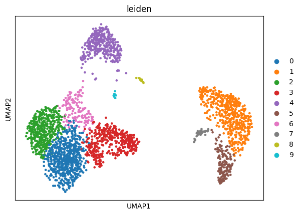
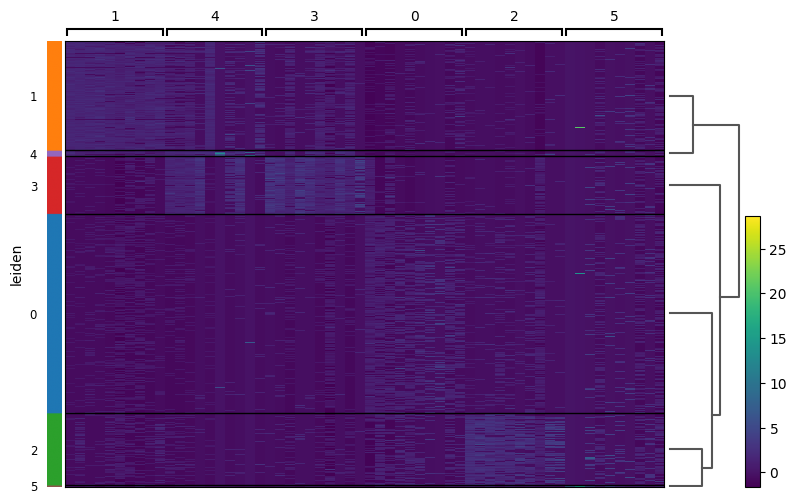
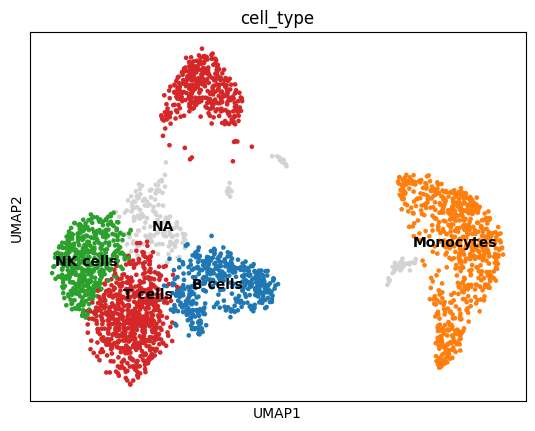

# Immune Microenvironment Analysis (scRNA-seq + Cell Communication)

A complete single-cell RNA-seq analysis pipeline for profiling the immune microenvironment using PBMC data. This project integrates clustering, differential expression, and ligand–receptor signaling analysis with an interactive Streamlit dashboard.

---

## Project Overview

This project analyzes immune cell heterogeneity using PBMC single-cell RNA-seq data and reconstructs intercellular communication networks.

Key goals:
- Identify immune cell populations
- Perform clustering and visualization
- Detect marker genes via differential expression
- Infer cell–cell communication (ligand–receptor signaling)
- Deploy interactive dashboard for exploration

---

## Dataset

- PBMC3k dataset
- Source: Scanpy built-in dataset
- ~2700 peripheral blood mononuclear cells (PBMCs)

---

## Pipeline Summary

### 1. Data Processing
- Quality control (filtering genes/cells)
- Normalization & log transformation
- Highly variable gene selection

### 2. Dimensionality Reduction
- PCA
- UMAP embedding

### 3. Clustering
- Leiden clustering for immune cell identification

### 4. Immune Annotation
Marker genes used:

| Marker | Cell Type |
|---|---|
| CD3D | T cells |
| MS4A1 | B cells |
| NKG7 | NK cells |
| LYZ | Monocytes |

### 5. Differential Expression
- Rank genes per cluster using Wilcoxon test
- Marker gene identification
- Heatmap visualization of cluster signatures

### 6. Cell–Cell Communication (LIANA)
- Ligand–receptor inference
- Immune signaling network reconstruction
- Interaction scoring between clusters

---

## Key Outputs

## UMAP Clustering

---

## Immune Cell Type Annotation

---
## Differential expression Heatmap

---

### UMAP Visualizations
- Immune cell clustering
- Gene expression patterns

### Differential Expression
- Cluster-specific marker genes
- Heatmap of top DE genes

### Cell Communication Network
- Ligand-receptor interaction table
- Source → Target immune signaling map

---

## Tech Stack

- Python
- Scanpy
- AnnData
- LIANA
- Pandas / NumPy
- Streamlit
- Git & GitHub

---

## Project Structure
scRNA-immune-microenvironment-analysis/
│
├── app.py # Streamlit dashboard
├── pbmc_analysis.py # Main preprocessing pipeline
├── DE_analysis.py # Differential expression module
│
├── figures/
│ └── final_outputs/
│ ├── umap_leiden.png
│ ├── umap_celltypes.png
│ ├── rank_genes_groups_leiden_de_markers.png
│ └── heatmap_leiden_de_heatmap.png
│
├── results/
│ └── liana_cellcell_interactions.csv
│
└── README.md

---

## Streamlit App Features

- UMAP visualization of immune cells
- Marker gene expression explorer
- Cluster composition viewer
- Cell–cell communication module (LIANA)

---

## Biological Insights

- Identified immune cell heterogeneity in PBMC dataset
- Revealed cluster-specific marker genes
- Reconstructed ligand–receptor signaling networks:
  - S100A9 → CD68 (monocyte activation)
  - HLA-B → CD3D (T cell signaling)
  - B2M → CD1C (antigen presentation axis)

---

## Future Extensions

- Pathway enrichment (GO / KEGG)
- Spatial transcriptomics integration
- Drug target prediction from signaling networks
- Multi-sample comparative analysis

---

## Author

Dr. Divya Mishra, Ph.D.  
Bioinformatics & Computational Biology

---

## Note

This project is fully reproducible and designed as a portfolio-grade bioinformatics workflow integrating single-cell analysis and immune communication modeling.
